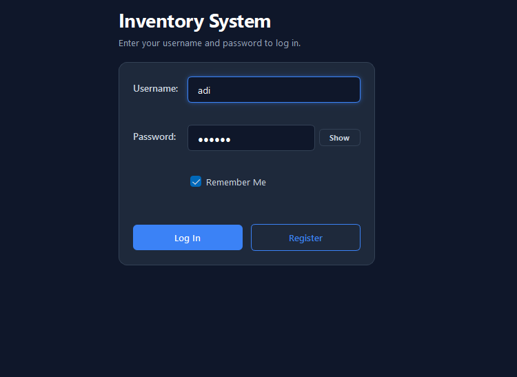
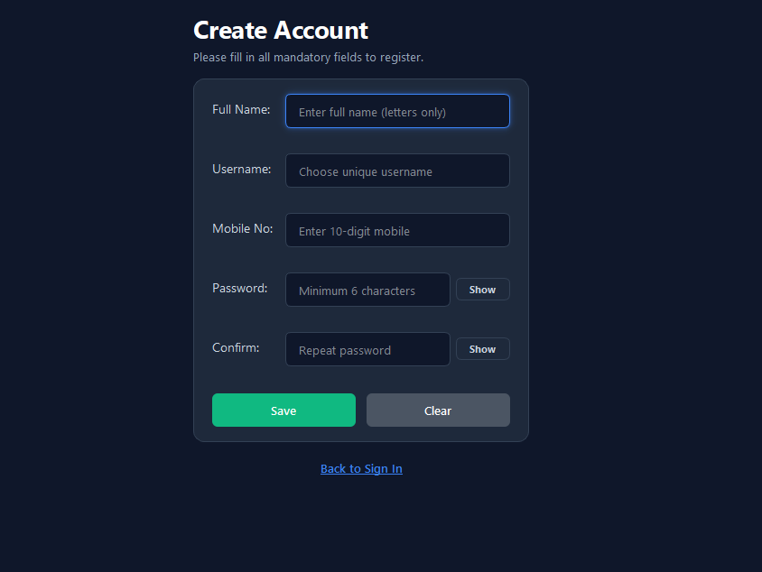
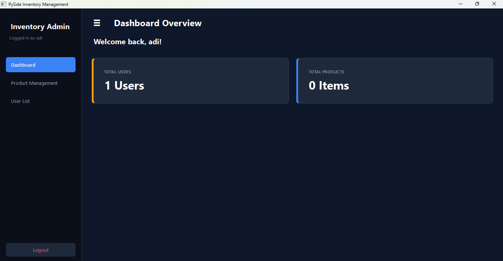
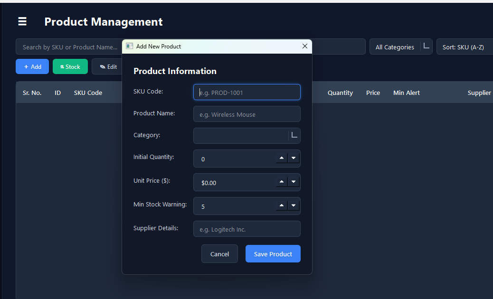
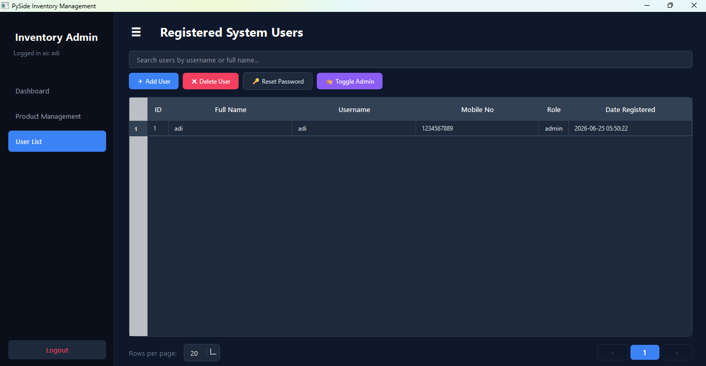

# 📦 Inventory Management System

A modern desktop-based **Inventory Management System** built with **Python** and **PySide6**, featuring secure user authentication, inventory tracking, user management, and an intuitive dark-themed interface.

---

## ✨ Features

### 🔐 Authentication

* Secure login system
* User registration
* Password hashing
* Remember Me functionality
* Session management

### 📊 Dashboard

* Overview of total users
* Total products counter
* Clean analytics dashboard
* Modern responsive interface

### 📦 Product Management

* Add new products
* Edit product details
* Delete products
* Update stock quantity
* Search products by SKU or name
* Category filtering
* Product sorting
* Low stock alerts
* Import inventory data
* Export inventory data

### 👥 User Management

* View all registered users
* Add new users
* Delete users
* Reset user passwords
* Toggle Admin/User roles
* Search users

### 🎨 User Interface

* Modern dark theme
* Sidebar navigation
* Dashboard cards
* Responsive layouts
* Clean dialogs and forms
* User-friendly controls

---

## 🛠️ Tech Stack

* **Language:** Python 3
* **GUI Framework:** PySide6 (Qt for Python)
* **Database:** SQLite
* **Data Generation:** Faker
* **Configuration:** ConfigParser

---

## 📂 Project Structure

```text
Inventory-Management-System/
│
├── authentication.py
├── inventory_management.py
├── fake_data.py
├── config.ini
├── inventory.db
├── requirements.txt
├── .gitignore
├── README.md
└── screenshots/
    ├── login.png
    ├── register.png
    ├── dashboard.png
    ├── product-management.png
    ├── add-product.png
    └── user-management.png
```

---

## 📸 Screenshots

### Login Screen



---

### Registration Screen



---

### Dashboard



---

### Product Management



---

### Add Product


---

### User Management



---

## 🚀 Installation

### 1. Clone the repository

```bash
git clone https://github.com/AdityaUpadhyayaXD/Inventory-Management-System.git
```

### 2. Navigate to the project

```bash
cd Inventory-Management-System
```

### 3. Create a virtual environment

```bash
python -m venv .venv
```

### 4. Activate the virtual environment

**Windows**

```bash
.venv\Scripts\activate
```

**Linux / macOS**

```bash
source .venv/bin/activate
```

### 5. Install dependencies

```bash
pip install -r requirements.txt
```

### 6. Run the application

```bash
python authentication.py
```

---

## 💡 Functionalities

* Secure authentication system
* Inventory CRUD operations
* Product search and filtering
* Stock management
* User administration
* SQLite database integration
* Dashboard statistics
* Import and export support

---

## 🔮 Future Improvements

* Barcode scanner integration
* Email notifications for low stock
* Sales & Purchase Management
* PDF report generation
* Excel export enhancements
* Charts and analytics dashboard
* Multi-warehouse support
* Backup & Restore functionality
* Cloud database support
* Executable (.exe) release

---

## 📖 Learning Outcomes

This project helped me gain practical experience with:

* Object-Oriented Programming (OOP)
* Desktop application development
* SQLite database integration
* User authentication
* CRUD operations
* GUI design with PySide6
* Modular project architecture
* Inventory management concepts

---

## 👨‍💻 Author

**Aditya Upadhyaya**

Computer Science Engineering Student

GitHub: https://github.com/AdityaUpadhyayaXD

---

## ⭐ Support

If you found this project helpful, consider giving it a ⭐ on GitHub!
